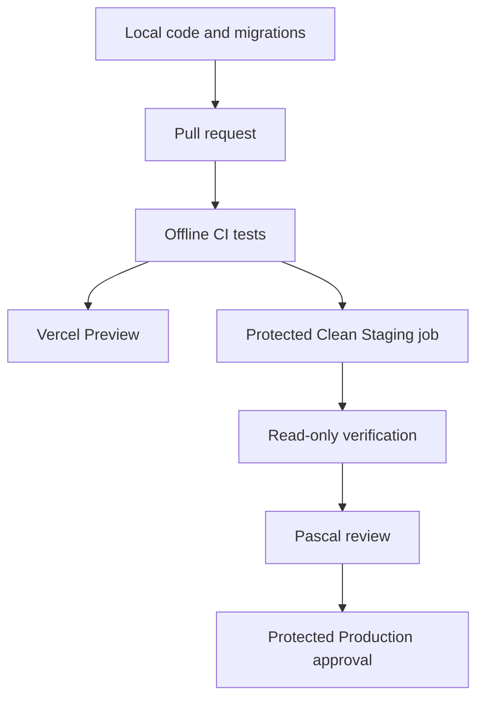

# Poster Valley architecture

## Product stack

The current specialist stack remains the preferred architecture:

| Concern | Service |
| --- | --- |
| Source, review, CI and deployment approvals | GitHub |
| Frontend and serverless application | React/Vite on Vercel |
| Database and Admin authentication | Supabase/Postgres |
| Transactional email | Resend |
| Payments | Mollie |
| Error monitoring | Sentry, to be introduced in a bounded product-readiness task |

Changing hosting providers or self-hosting is not part of the reset. The incident that triggered
this decision occurred in the local credential-control chain, not in the application hosting
layer.

## Runtime trust boundaries

- The browser is untrusted.
- Vercel server functions own price, shipping, authorization, payment initiation, and privileged
  Supabase access.
- Supabase owns persistent data, RLS, database constraints, and Admin identity.
- Mollie is the sole payment authority.
- Resend delivery is server-side and suppressed outside Production.
- GitHub owns source history, review gates, CI credentials, and deployment approvals.
- Production remains inaccessible to ordinary feature tasks.

## Development and delivery

### Local

- Develop without remote database passwords.
- Use deterministic unit, contract, and local PostgreSQL tests.
- Generate additive migration files and review them in Git.
- Do not use an AI session as an infrastructure credential broker.

### Pull request and Preview

- GitHub Actions runs lint, tests, build, governance checks, and local database-contract tests.
- Vercel creates the application Preview.
- Database changes are not applied merely because a branch or Preview exists.
- Provider email stays suppressed and Mollie stays in test mode.

### Clean Staging

- A protected GitHub environment stores only the credentials required by the Staging job.
- The job identifies project ref `stbunwkgvxfwmbjivgos`, verifies committed-versus-remote history,
  produces exact migration-plan evidence, and stops on drift or unexpected scope.
- Application of reviewed migrations is a distinct gated job.
- Post-apply verification is read-only and prints no credential values.
- Codex may author and review the workflow but does not receive the database password.

### Production

- Use a separate protected GitHub environment and separate secrets.
- Require explicit human approval for the exact release.
- Never reuse Clean Staging credentials or settings.
- Preserve database-first compatibility, rollback/forward-fix planning, and provider-specific
  smoke-test approval.

## Prohibited architecture

Do not reintroduce:

- interactive database passwords passed through Codex, shell launchers, or nested child processes;
- duplicate secret variables whose equality must be maintained across process boundaries;
- custom wrappers, shims, probes, or launchers when a managed provider boundary can perform the job;
- feature work that silently expands into infrastructure recovery;
- self-hosted Vercel/Supabase replacements without a separate business case and total-cost review.

## Change control

Read [OPERATING_RULES.md](OPERATING_RULES.md) before adding infrastructure, credentials, provider
integrations, or process layers. Record a new ADR when changing a provider, trust boundary,
deployment authority, commerce authority, or persistent environment model.
